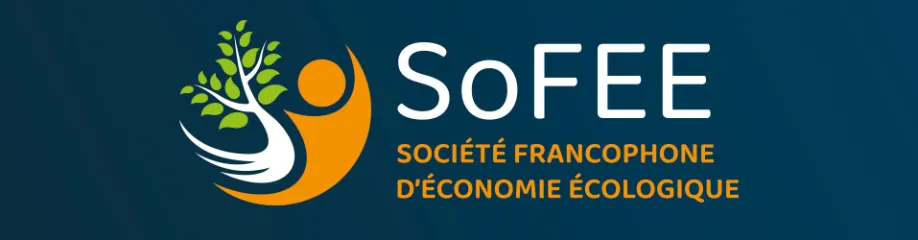

## « Valuations écologiques : évaluer, commensurer, compenser, monétiser ? »

Peu de séminaires principalement dédiés à l’économie écologique existent aujourd’hui. Partant du constat de la présence de forces vives à Grenoble et en Auvergne-Rhône-Alpes, nous souhaitons mettre en place un espace d’émulation ancré localement mais ouvert, autour des problématiques socio-écologiques, qui mobilise différents champs des sciences économiques et sociales. Ces rencontres se veulent aussi ouvertes aux personnes issues des sciences de l’ingénieur et des sciences de la nature qui souhaitent aborder la dimension socio-économique des enjeux de soutenabilité. L’objectif est **créer une dynamique de groupe pérenne et conviviale, avec des rencontres régulières et des formats originaux**.

**Pour la première année de ces rencontres, nous proposons un thème** voulu à la fois ouvert et fondé sur une problématique historique en économie écologique : celle de la valeur.  Ces rencontres seront donc intitulées **« Valuations écologiques : évaluer, commensurer, compenser, monétiser ? »**. 

Les rencontres débuteront par une période d’essai durant les 4 premiers mois, et le thème de la valuation structurera les 18 premiers mois. Trois types de séances se succéderont et chaque groupe de trois séances correspondra à une sous-thématisation du thème général de la valuation. Les séances auront lieu tous les mois et demi environ. **Chacun de ces cycles tripartites sera organisé de la manière suivante :**

1. Dans un premier temps, un temps de réflexion sera consacré à l’exploration des **concepts** et controverses qui traversent ce champ de recherche, permettant ainsi de dégager les fondements théoriques et historiques. Ce temps sera dédié à la lecture et à la discussion approfondie d’un texte qui constituera le point de départ d’une réflexion collective.
2. Ensuite, l’accent sera mis sur la présentation d’une **méthodologie** par un.e intervenant.e issu.e, entre autres, du champ de l’économie écologique. Il s’agira d’entrer dans le détail concret d’une méthode, de sa mise en œuvre, de ses outils ; afin d’apporter un éclairage par le terrain sur la question de la valuation et de l’économie écologique.
3. Enfin, une troisième séance clôturera le cycle par un séminaire dans un format  de duos d’un.e jeune chercheur.se et d’un.e collègue plus établi.e, qui seront amenés à **présenter** leurs travaux s’inscrivant dans la sous-thématique traitée.

Nous invitons l’ensemble des chercheurs et acteurs intéressés à se joindre à cette initiative. **Votre présence régulière et/ou vos contributions**, qu’elles soient d’ordre théorique ou appliqué, feront la richesse des échanges. Ce projet se veut avant tout un lieu d’échange convivial, constructif, propice à l’émergence d’idées renouvelées et de potentielles collaborations.

[Mohammed Kharbouche](nicolas.laurence1@univ-grenoble-alpes.fr)
[Nicolas Laurence](mohammed.kharbouche@univ-grenoble-alpes.fr)
[Albert Bouffange](albert.bouffange@inria.fr)

